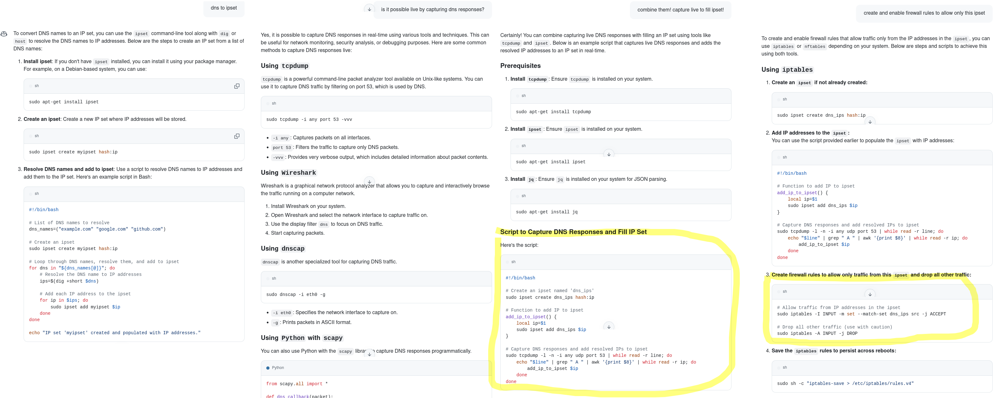
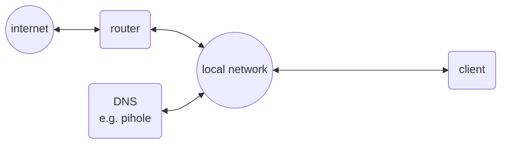
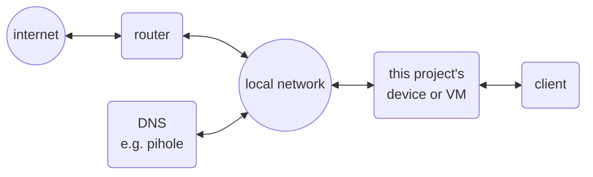

# dns2ipset
Whitelist DNS responses' IP addresses in iptables firewall by ipset.

## Goal

My goal is exactely the same as [this user's goal:](https://www.reddit.com/r/PFSENSE/comments/18nqoc0/is_it_possible_to_dynamically_whitelist_ips_in_an/)
"I already block malware domains with DNS filtering (pfBlockerNG/PiHole/etc) but I want to go a step further and see if it's possible to set up a pfSense such that it dynamically allows outbound traffic only to IPs that were contained in recent results of valid DNS queries (or specifically whitelisted) and blocks traffic to all other IPs by default."

I need (want) to provide (very) restricted internet access to a client (device and user). DNS filtering is of great help, but easy to overcome in several ways.

## Other projects

You most likely don't need this project.

After having built my solution as a proof of concept, I found that there are other approaches aiming for the same. I have not tested, but if you are starting in the same situation you may want to have a look at [ipset-dns](https://git.zx2c4.com/ipset-dns/about/)
or specifically at this old comment:
> "This functionality has now been written directly into **dnsmasq**, which should be much easier to use than this project. See the --ipset option."

I don't know if this (still) works, as there seem to be even newer [discussions](https://forum.openwrt.org/t/dnsmasq-full-ipset-support-removed-in-23-05-and-master/150274), 
but I like the approach, because it should allow for integration into a single router/firewall/etc-appliance.

When searching github for the right keywords I also found [dnsnfset](https://github.com/sorz/dnsnfset), which uses [dnstap](https://dnstap.info/), a "log format for [...] events that occur inside DNS software ", implemented e.g. in **unbound**. 

You can even ask github copilot for solving the task in the way I did manually. Amazing what is possible with a few prompts.

## My approach

Although I did not find a complete solution (at first), I knew or found several puzzle parts that I consider helpful, and I was curious if it is possible to combine them, so I tried :)
* tcpdump. Allows capturing network traffic and decoding (unencrypted) DNS traffic
* iptables with ipset. Allows traffic filtering based on a list of IP addresses, which can even be be modified dynamically without changing iptables' rules.
* bridge-utils. Allows building a transparent bridge between two network segments.

This can be implemented on a (virtual) machine with two (virtual) network interfaces.

Situation before:

Situation proposed:

The idea is placing the client to be protected on one side, and everything else on the other, so that all traffic must flow through our bridge. 

This allows us to filter the traffic based on a whitelist, e.g. allowing only:
- traffic to the local network, e.g. a (local) DNS server,
- traffic to addresses on our list (which we maintain by evaluating tcpdump's output for DNS responses)

This enforces indirectly that the (local/trusted/filtering) DNS server must be used. Bypassing the (admin-)desired server results in blocking the corresponding traffic.

Advantage:
- prevents client-side DNS "misconfiguration" to overcome restrictions
- fully transparent. Protocol-agnostic. Does not break encryption.
- should work with every DNS server; no specific interface required,
- though it prevents from using encrypted DNS (e.g. DNSoverHTTPS) to overcome the restrictions.
- in theory could be built as simple-to-integrate zero-configuration device (the function itself does not even require a own ip address; but access is handy for development/debugging).

Caveats:
- requires change to the network topology (other than a pihole which is simple to add).
- only proof of concept, for sure not bulletproof. Judge for yourself if this suits your performance and security demands when using in real world.
- implemented for IPv4 only (though the concept could be adapted to work for IPv6 too).
- implementation is not reboot-persistant (may be added by ipset save|restore command) and does not care about TTL (permission is never revoked, only at reboot)

## Setup

Tested on a fresh Debian 12.6 in Jan25. Just hints, no ready-to-run-script:

    apt install bridge-utils
    brctl addbr br0
    uncomment #net.ipv4.ip_forward=1  in /etc/sysctl.conf 
    apt install tcpdump
    apt install ipset
    edit /etc/network/interfaces for br0 and pre-up-script.
    copy /etc/network/iptables.firewall
    copy /etc/network/firewallup.sh
    copy /etc/systemd/system/tcpdumpdns.service
    copy /root/tcpdumpdns.sh
    reboot
    systemctl start tcpdumpdns.service 
    systemctl enable tcpdumpdns.service 
    systemctl status tcpdumpdns.service 

